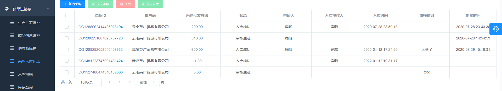

# 分布式医疗平台

### 介绍
分布式医疗项目，包括系统管理、ERP系统、看病就诊、收费管理等功能。

### 软件架构
SpringBoot、MyBatis-Plus、Zookeeper、Dubbo、Redis、Shiro、RocketMQ

### 使用说明

1.  采用前后端分离方式开发，后端根据接口文档完成功能开发

2. 项目是一个聚合项目，依据不同的服务对模块划分，是分布式架构。
3. 采用Dubbo进行分布式管理与开发，针对于当前的环境自定义配置参数，像zookeeper注册中心，服务端口等。

### 项目说明
#### 系统管理
包含科室管理、用户管理、角色管理、菜单管理、日志管理、费用设置

#### 药品进销存
包含生产厂家维护、药品信息维护、供应商维护、采购入库、审核、库存查询

#### 就诊
包含新开就诊、门诊挂号、挂号列表、医生排班、患者库

#### 收费
处理挂号收费、检查收费、药品处方收费等业务，支持支付宝线上收费方式以及退费功能

