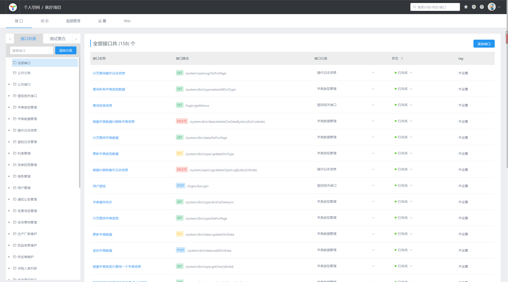

# 分布式医疗平台

#### 介绍
搭建的分布式医疗项目，主要负责后端开发工作，包括系统管理、ERP、看病就诊、收费管理等功能。

#### 软件架构
SpringBoot、MyBatis-Plus、Zookeeper、Dubbo、Redis、Shiro、RocketMQ

#### 使用说明

1.  采用前后端分离方式开发，后端根据接口文档完成功能开发

2. 项目是一个聚合项目，依据不同的服务对模块划分，是分布式架构。
3. 采用Dubbo进行分布式管理与开发，针对于当前的环境自定义配置参数，像zookeeper注册中心，服务端口等。
